# Sewn

A personalized AI assistant server written in Swift on [Hummingbird 2](https://hummingbird.codes). Sewn is the **reasoning layer** of [MaryOS](https://maryos.ai) — rao studios' operating system for the generative age — and the **orchestration layer** of a distributed retrieval architecture: it owns authentication, chat completions, sentiment-tuned generation, attribution and royalty accounting, and fan-out to **Thread** nodes, independently deployed search nodes that hold all document, knowledge-graph and vector data. Sewn coordinates it; Thread stores and searches it.

*"When does generative AI qualify for fair use?"*

**Project started:** 2025-10-26

---

## Introduction

Most retrieval-augmented assistants treat a corpus as anonymous background
material: text goes in, an answer comes out, and the question of *whose words
shaped it* is unanswerable by the time the response is streamed. Sewn is built
around the opposite premise — that the answer should be able to name its
sources down to the character offset, and that the people who wrote those
sources should be paid for the influence.

Three ideas make that work, and they are the three named subsystems:

- **Thread** holds the data. Sewn stores no vectors and no graph of its own.
  Thread nodes register themselves with Sewn over gRPC, hold a long-lived
  bidirectional session, and receive every search, index, and remove as
  fan-out on that session. Adding capacity means starting another Thread node;
  it announces itself and immediately joins the fan-out set.

- **Sinatra** decides *how* to answer. A per-user Gradient Boosted Trees model
  scores the sentiment and engagement of each turn and tunes the generation
  parameters — temperature, top-p, repetition penalty — for the next one. It
  trains on a resonance signal: the specific passage a user actually responded
  to, extracted from their reply, gated so that a turn with no detectable
  resonance trains nothing.

- **Gita** decides *who gets paid*. Retrieved text gives each contributing
  document a share of the turn by word count. The model then cites its sources
  with invisible `[[n]]` markers, which Sewn strips before the user sees the
  reply and resolves into exact character spans — the evidence for each share.
  The result is priced against the turn's real token cost, including the
  internal calls the user never sees.

Around that core sit the parts any assistant needs: Supabase-backed auth,
a provider layer that will answer from Mistral, Tinker, or an on-device MLX
model without the client knowing which, a streaming chat API, a low-latency
voice path, and a Prometheus/Grafana observability stack.

Everything is one Swift process. Heavy state lives in actors rather than an
external database, and what must survive restart is persisted as JSON and a
write-ahead log under `~/Documents/sewn-db`.

### Where this sits in MaryOS

Sewn is not a standalone product. It is the reasoning layer of **MaryOS**, rao
studios' operating system for the generative age — and "operating system" is a
claim about structure rather than scale: MaryOS is deliberately not one program.
**Mary** is the surface a person talks to; reasoning, memory, and the training of
the small models that let it act are each their own piece, built to keep working
correctly whether or not the others are paying attention.

Sewn is the reasoning piece. Mary loads no model in her own process — every
generation rides Sewn, and everything she remembers is held by Thread. That
division is why this repository cares so much about attribution and providers:
it is the component that decides *which* backend answers and *whose* words
shaped the answer, on behalf of every surface above it.

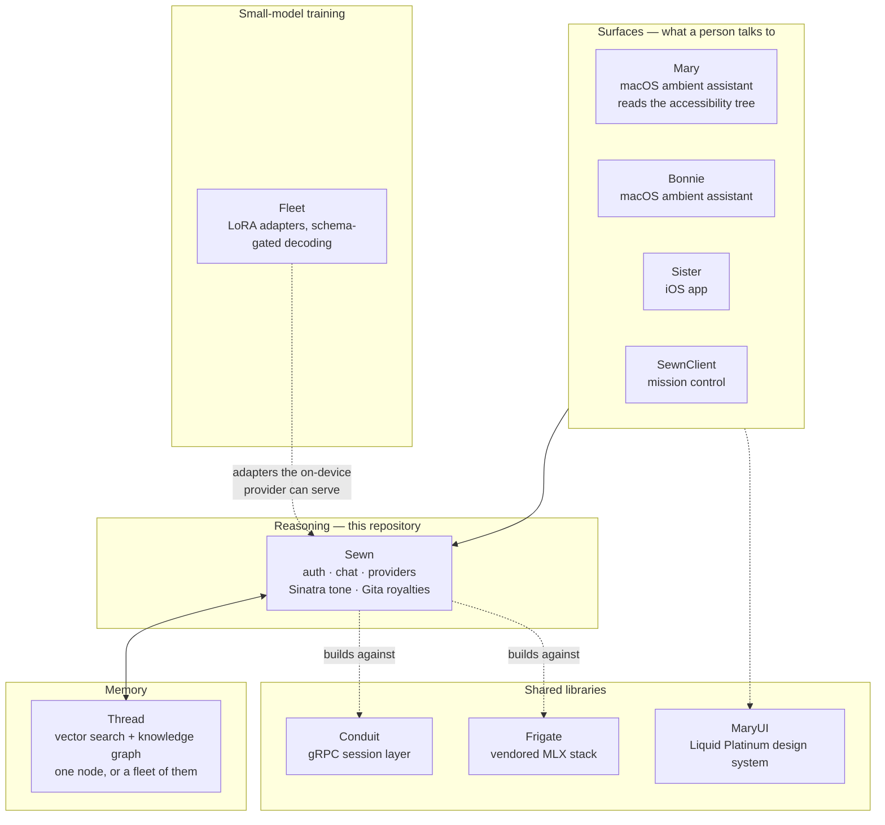

The seams show up in this codebase as named clients rather than abstractions.
A request carrying `client: "bonnie"` is re-framed so that retrieval becomes
*support* for the current request — background that helps, never material that
redirects — and that client's own tool-action deposits (`bonnie-tool-…`
documents) are rendered as a separate tier the model is told not to recite. The
on-device provider's default is the same Hub id Mary used to load in-process, so
a machine that already downloaded it pays nothing to move that work behind the
server. `/v1/code/complete` pins its own model because Mary does not send one.

A MaryOS install keeps each component's state side by side, which is the clearest
picture of the split:

```
~/Documents/MaryOS/
├── sewn-db/      # this repository — registry, Sinatra models, wallet
├── thread-db/    # memory — graphs, vectors, documents
└── fleet-db/     # training — datasets, adapters
```

Sewn is usable on its own, and the rest of this README documents it that way.
The MaryOS framing explains *why* it is shaped like this: a reasoning layer with
no memory of its own, no UI, and a hard rule that the answer must be able to name
its sources.

### What's in this repository

| Path | Contents |
|------|----------|
| [`Sources/API/`](Sources/API/) | HTTP and WebSocket surface — routes, middleware, request/response models |
| [`Sources/Core/`](Sources/Core/) | The `Sewn` actor: chat orchestration, search, document lifecycle, Thread fan-out |
| [`Sources/Sinatra/`](Sources/Sinatra/) | GBT sentiment model, harmony memory, technical indicators, tone adjustment |
| [`Sources/Gita/`](Sources/Gita/) | Attribution spans, royalty math, token ledger, wallet and credit exchange |
| [`Sources/Providers/`](Sources/Providers/) | Mistral, Tinker, and on-device MLX backends; embeddings; Supabase |
| [`Sources/Conduit/`](Sources/Conduit/) | gRPC server that Thread nodes register against |
| [`Client/`](Client/) | SewnClient — a macOS SwiftUI app for running servers, inspecting the graph, and chatting with cited sources |
| [`Skills/`](Skills/) | Subsystem reference docs, one per area |
| [`Dashboards/`](Dashboards/) | Importable Grafana dashboard JSON |

Sewn has a companion iOS app, Sister — [Open Source](https://github.com/riteshpakala/Sis).

---

## Core Services

| Service | Description |
|---------|-------------|
| **Sewn** | Orchestration layer: auth, RAG search, chat completions, document lifecycle, Thread fan-out. |
| **Sinatra** | Gradient Boosted Trees (GBT) sentiment analysis that dynamically adjusts generation parameters (temperature, top-p, repetition penalty) based on conversation tone. Also collects RLHF training data via user reactions. |
| **Gita** | Royalty tracking system that calculates contribution percentages for each document owner whose data influenced an inference. |
| **Thread** (external) | Distributed search nodes. Each Thread registers with Sewn over gRPC, holds a persistent bidirectional session stream, and receives all search/index/remove/library fan-out through that session. Knowledge graphs, HNSW graphs, and PQ codebooks live on Thread nodes. |

---

## Architecture

### System topology

Sewn is the hub. Clients only ever talk to Sewn; Thread nodes dial *in* to it
and stay connected, so the set of nodes serving a query is whatever is
registered at that moment.

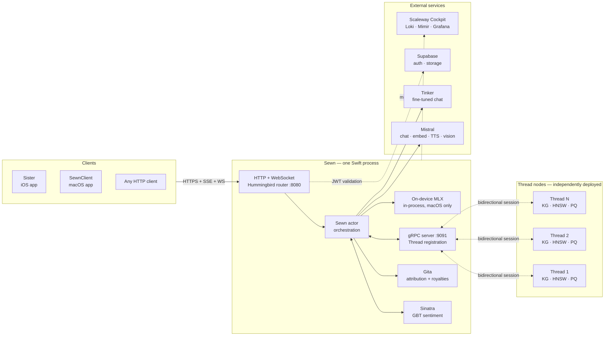

Sewn holds no vectors and does no embedding. Search and remove are broadcast
over the Thread sessions and the results merged on the way back; indexing is
routed to a single node, which Sewn then remembers as that owner's node.

---

### Chat completion — the full request lifecycle

The most composed path in the system. Sentiment analysis and retrieval start
together, because neither depends on the other; everything downstream waits on
both.

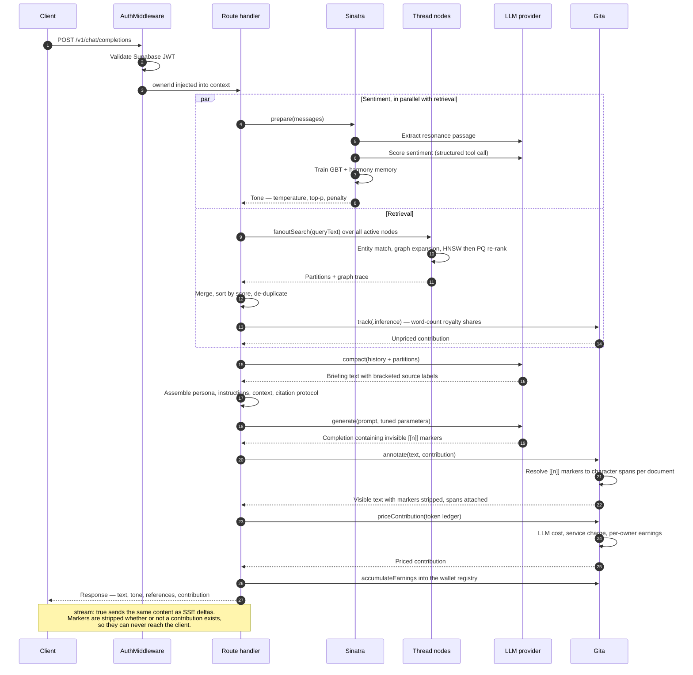

Attribution lands in two stages, and the split matters: the retrieval step
already knows *which documents* were consulted and in what proportion, but only
the generated text reveals *which sentences actually used them*. So the shares
are computed during search, refined into character spans once the model has
spoken, and priced last — against the turn's real token ledger, which by then
includes the compaction, resonance, and sentiment calls as well as the
generation itself.

---

### Thread registration and the session stream

Thread nodes connect to Sewn, not the reverse. That inversion is deliberate: a
Thread node can live behind NAT, on a laptop, or in another region, and still
join the fan-out set the moment it starts.

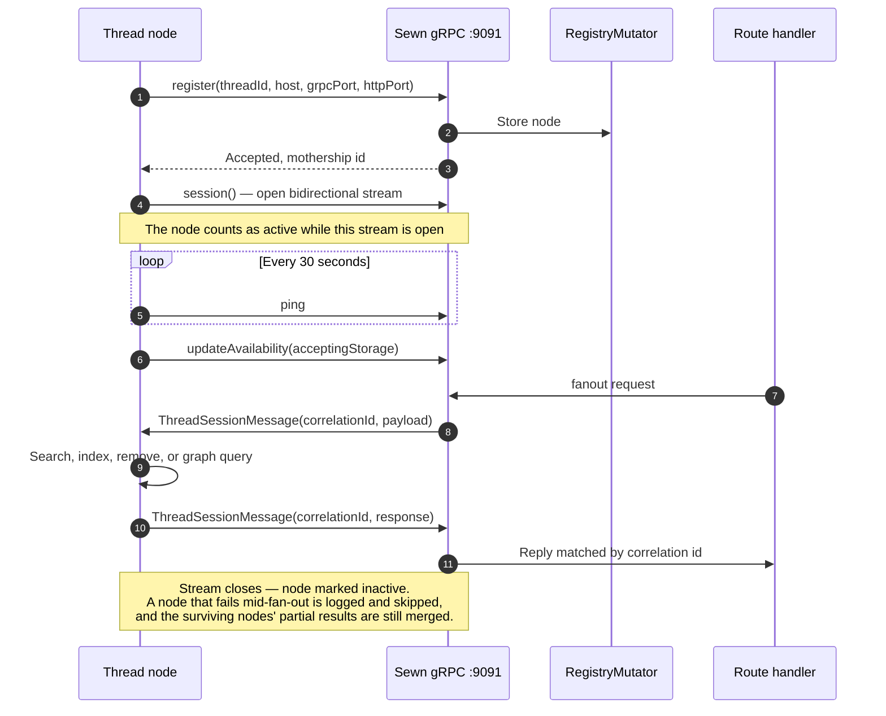

Only nodes with an open session receive fan-out, and only nodes reporting
`acceptingStorage` receive new documents.

---

### Indexing a document

Sewn prepares and routes; Thread embeds and stores. Nothing about a document's
vectors is Sewn's to keep, so indexing is a placement decision followed by a
hand-off.

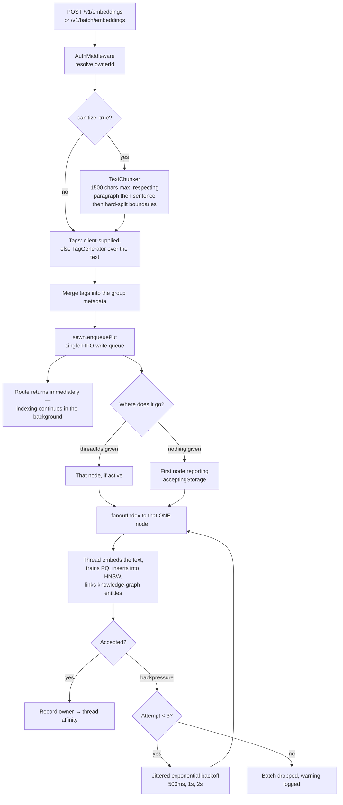

Indexing is the one operation that is *not* broadcast. A document lives on a
single Thread node, and Sewn records which one, so search fan-out is what makes
it findable again. Writes go through one FIFO drain because HNSW insertion walks
the graph to choose neighbours — two concurrent inserts against an inconsistent
graph produce undefined edges.

---

### Sinatra — the sentiment feedback loop

Sinatra is the only part of the system that learns online. It runs once per
turn and is gated twice, so that thin or ambiguous turns teach it nothing.

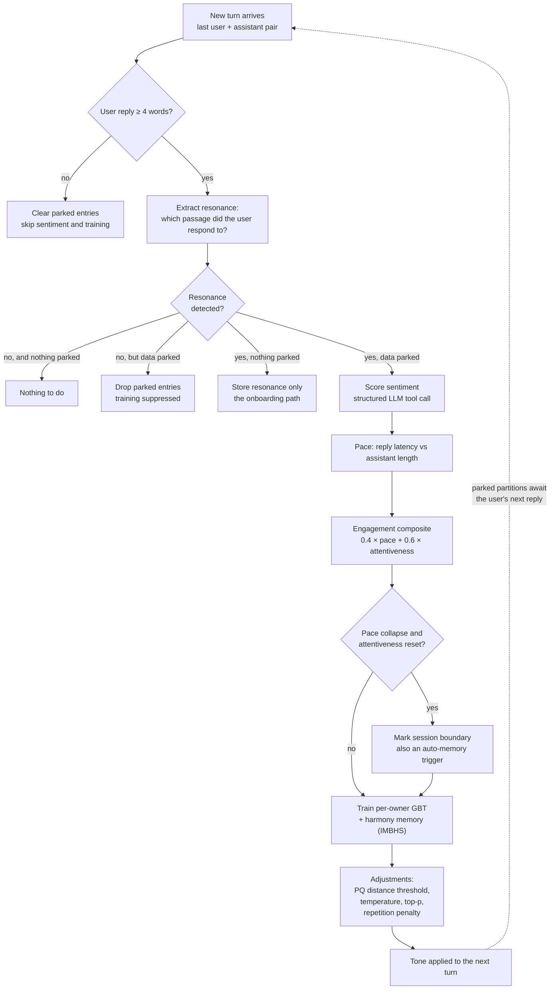

Retrieved partitions are *parked* rather than trained on immediately — the label
is the user's next reply, which has not happened yet. The loop closes one turn
later.

---

### Gita — from retrieved text to credit

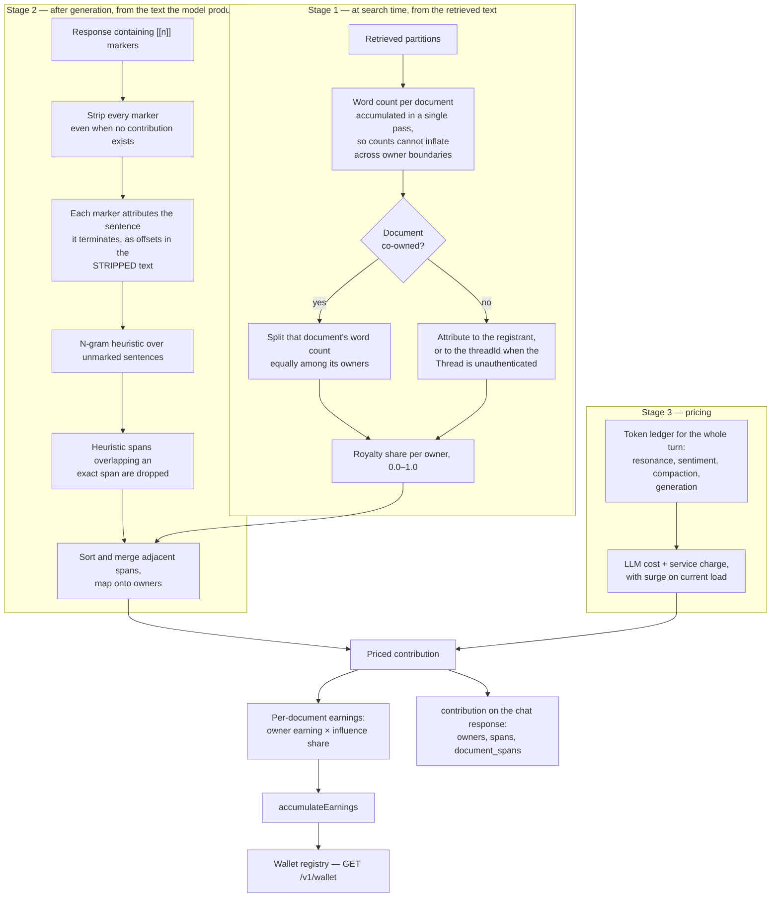

An unmarked sentence still gets attributed, just heuristically — the exact spans
win wherever the two disagree. Equal split among co-owners is the deliberate
baseline; weighting by upload date, retrieval count, or an explicit stake is
marked as future work in the source.

---

### Realtime voice — the two-pass turn

`/v1/realtime/chat` trades a little quality on the first sentence for a large
drop in time-to-first-audio. An opening pass speaks from conversation history
while retrieval is still in flight; a grounded pass then carries the rest of the
turn over the retrieved context.

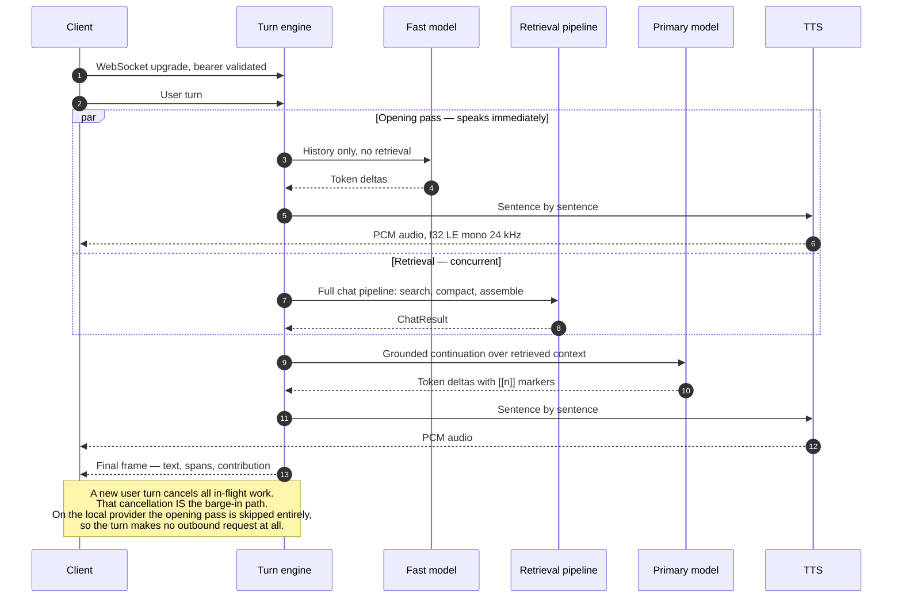

---

### Startup sequence

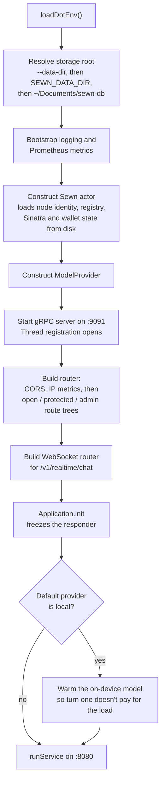

Routes must all be registered before `Application.init` — it freezes the
responder, so a route added afterwards is silently unreachable.

---

### Persisted state

Thread owns the graphs and vectors. What Sewn keeps is comparatively small:
ownership, economics, and learned models.

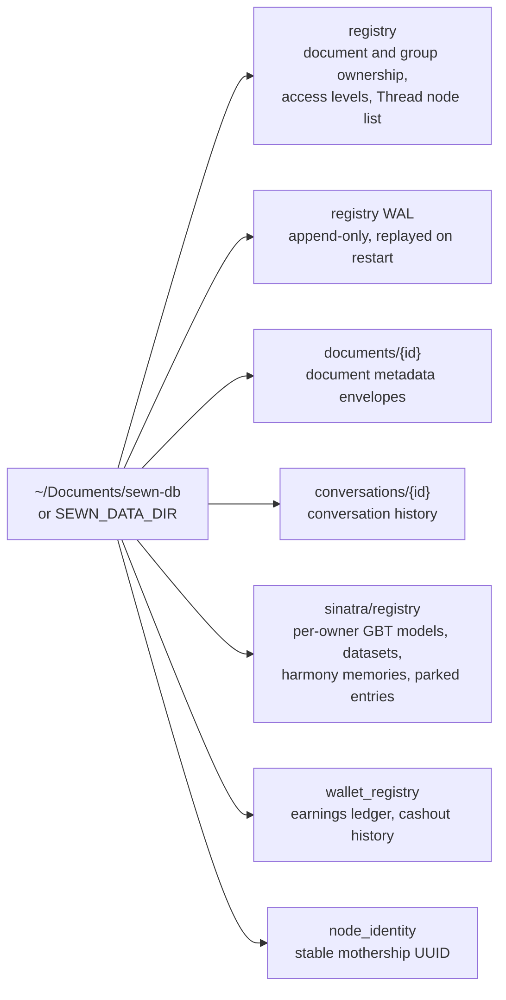

All of it routes through `PersistenceActor`, so disk I/O never blocks the actor
that owns the data.

---

## Authentication

Powered by [Supabase](https://supabase.com) via [supabase-swift](https://github.com/supabase/supabase-swift). All protected routes require `Authorization: Bearer <access_token>`. The `AuthMiddleware` validates each token and injects the resolved `userId` into every downstream handler.

### Endpoints (no auth required)

| Method | Path | Description |
|--------|------|-------------|
| `POST` | `/v1/auth/sign-up` | Register a new user |
| `POST` | `/v1/auth/sign-in` | Sign in with email + password |
| `POST` | `/v1/auth/verify` | Verify OTP (signup / recovery / magic link) |
| `POST` | `/v1/auth/refresh` | Refresh an access token |
| `POST` | `/v1/auth/reset-password` | Send a password recovery email |
| `POST` | `/v1/auth/resend` | Send the signup or recovery code again |
| `POST` | `/v1/auth/sign-out` | Invalidate the current session (requires Bearer) |
| `POST` | `/v1/auth/update-password` | Set a new password (requires Bearer) |
| `GET` | `/v1/account/keys` | Provider keys for a verified account, from `ambient_keys` (requires Bearer) |

**`POST /v1/auth/sign-in`**
```json
// Request
{ "email": "user@example.com", "password": "secret" }

// Response
{ "accessToken": "...", "refreshToken": "...", "expiresIn": 3600, "userId": "uuid" }
```

Route-level detail for every endpoint lives in [`Skills/SystemReference/RouteReference.md`](Skills/SystemReference/RouteReference.md).

---

## API Reference

All endpoints below require `Authorization: Bearer <access_token>` unless noted.

### System

| Method | Path | Auth | Description |
|--------|------|------|-------------|
| `GET` | `/health` | None | Health check |
| `GET` | `/metrics` | Token | Prometheus metrics. `--server-mode` only |
| `GET` | `/v1/models` | None | List available models |
| `GET` | `/v1/threads` | None | List registered Thread nodes |

**`GET /v1/threads`**
```json
// Response
{
  "mothership_id": "uuid",
  "enabled": true,
  "nodes": [
    {
      "thread_id": "uuid",
      "host": "192.168.1.2",
      "grpc_port": 9090,
      "http_port": 8080,
      "last_seen": "2026-05-24T10:00:00Z",
      "is_active": true,
      "accepting_storage": true
    }
  ]
}
```

---

### Embeddings & Indexing

Routed over the gRPC session to **one** Thread node — the one named in
`sewn.thread_ids`, else the first node reporting `acceptingStorage`. Thread
performs the embedding, PQ training, and HNSW insertion; Sewn only chunks,
tags, and places. The route returns as soon as the batch is enqueued, and
Thread backpressure is retried three times with jittered backoff before the
batch is dropped.

| Method | Path | Description |
|--------|------|-------------|
| `POST` | `/v1/embeddings` | Embed text and index a single document |
| `POST` | `/v1/batch/embeddings` | Batch embed and index multiple documents |

**`POST /v1/batch/embeddings`**
```json
// Request
{
  "inputs": [{ "values": ["chunk a", "chunk b"] }, { "values": ["chunk c"] }],
  "model": "mistral-embed",
  "sanitize": false,
  "sewn": { "owner_id": "uuid" }
}
// sanitize: true runs the text through TextChunker first (1500 chars max).
// Embedding happens on Thread, not here.
```

---

### Search

Fan-out to all active Thread nodes via gRPC. Results are merged, re-ranked, and deduped by Sewn.

| Method | Path | Description |
|--------|------|-------------|
| `POST` | `/v1/search` | Semantic KNN search over the user's document library |

**`POST /v1/search`**
```json
// Request
{
  "query": "what did I write about distributed systems?",
  "model": "mistral-embed",
  "sewn": { "owner_id": "uuid" }
}

// Response
{
  "texts": ["retrieved context chunk..."],
  "references": ["document-id-1"],
  "contribution": { "document-id-1": 0.87 }
}
```

---

### Providers — which backend answers

Every generation route takes an optional `provider` on the request body:
`"mistral"`, `"tinker"`, or `"local"`. Omit it and the server default applies
(`SEWN_GLOBAL_LLM` in `.env`, Mistral when unset), so a client that never heard
of providers is unaffected. An unknown value is a 400; a provider whose key is
missing, or an on-device backend this build cannot serve, is a **503 naming the
reason** — never a crashed server.

`local` runs the model **inside Sewn** through Frigate's MLX (macOS only). It
needs `mlx.metallib` beside the binary:

```sh
swift build -c release
./scripts/build-metallib.sh release     # SwiftPM has no Metal step
```

**How a turn's backend is resolved**

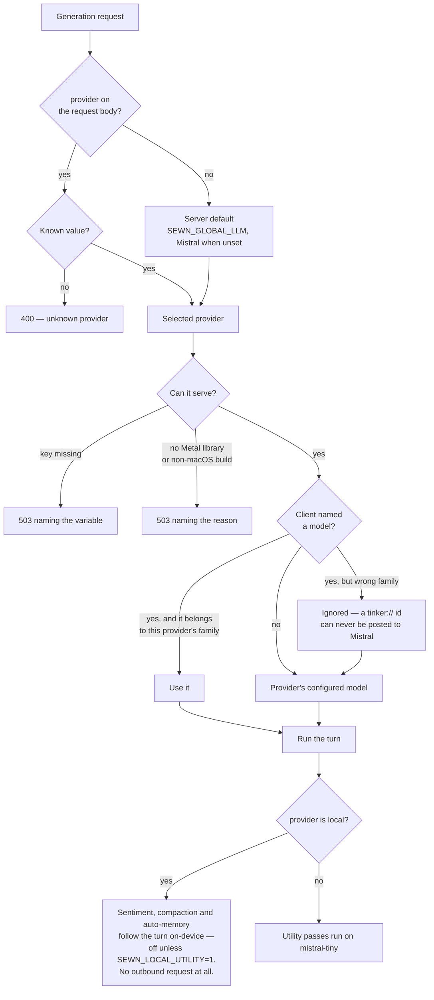

| Method | Path | Description |
|--------|------|-------------|
| `GET` | `/v1/providers` | Every backend: `available`, `state`, `model`, `capabilities`, and `reason` when it cannot serve |
| `POST` | `/v1/providers/local/warm` | Load the on-device model now, so the first turn does not pay for it. Idempotent |

**Which routes honor it**

| Route | mistral | tinker | local |
|---|---|---|---|
| `/v1/chat/completions` (SSE + non-stream), realtime grounded pass | ✅ | ✅ | ✅ |
| `/v1/skills/complete`, `/v1/code/complete` | ✅ | ✅ | ✅ |
| `/v1/complete` | ✅ | ✅ | ✅ |
| realtime **opening** pass | mistral-small | mistral-small | **skipped** — the grounded stream carries the turn rather than sending it off-machine |
| Sinatra sentiment / resonance, auto-memory, compaction | mistral-tiny | mistral-tiny | follows the turn; **off** unless `SEWN_LOCAL_UTILITY=1` (on one GPU these serialize behind every turn) |
| `/v1/vision/look`, `/v1/embed`, `/v1/embeddings`, `/v1/speak` | Mistral | Mistral | Mistral — no on-device equivalent yet |

A turn on `local` therefore makes **no outbound request at all**: sentiment,
compaction and auto-memory follow the turn's backend rather than quietly
reaching a vendor the user did not choose.

**Models per provider** — `SEWN_CHAT_MODEL` / `TINKER_MODEL` / `SEWN_LOCAL_MODEL`
for chat, `SEWN_CODING_MODEL` / `SEWN_LOCAL_CODING_MODEL` for `/v1/code/complete`,
`UTILITY_MODEL` for one-shots. A client-supplied `model` is honored only when it
belongs to the selected provider's family, so a `tinker://` id can never be
posted to Mistral's host.

### Chat Completions

| Method | Path | Description |
|--------|------|-------------|
| `POST` | `/v1/chat/completions` | Chat with Sinatra-tuned parameters and RAG context |
| `GET` | `/v1/personalities` | List chat personas (voice, params, model override) |
| `PUT` | `/v1/admin/personalities` | Replace the persona list (admin) |

**`POST /v1/chat/completions`**
```json
// Request
{
  "messages": [{ "role": "user", "content": "Summarize my notes on HNSW." }],
  "model": "mistral-medium",
  "personality": "scholar",
  "stream": false,
  "sewn": { "owner_id": "uuid" }
}

// Response (stream: false)
{
  "choices": [{ "message": { "role": "assistant", "content": "..." }, "finishReason": "stop" }],
  "usage": { "prompt_tokens": 120, "total_tokens": 350 },
  "personality": "scholar",
  "contribution": { "owners": [{ "spans": [], "document_spans": { "did": [{ "lower": 0, "upper": 42 }] } }] }
}
// stream: true → Server-Sent Events with delta chunks
```

Responses are attributed to their Thread source files: the model cites context
sources with invisible `[[n]]` markers which the server strips and resolves to
exact character-offset spans per document (`contribution.owners[].document_spans`),
falling back to n-gram heuristic spans for unmarked sentences.

Supports multi-modal input (images, video) when `--vlm` is enabled.

---

### Documents & Groups

| Method | Path | Description |
|--------|------|-------------|
| `POST` | `/v1/list/documents` | List all documents owned by the authenticated user |
| `POST` | `/v1/list/groups` | List all groups owned by the authenticated user |
| `POST` | `/v1/modify` | Update a document's access level, group, or delete it |
| `POST` | `/v1/modify/group` | Update a group's access state and label |
| `POST` | `/v1/modify/group/remove` | Delete a group and all its documents |

**`POST /v1/modify`**
```json
// Request
{
  "update": { "operation": "remove", "documentId": "did" },
  "sewn": { "owner_id": "uuid" }
}
// operation: "access" | "remove" | "group"
// "remove" fans out to Thread nodes; "access" and "group" update Sewn registry
```

---

### Storage & Backup

Supabase Storage bucket (`documents`) with path `{userId}/{groupId}/{documentId}`. RLS enforces per-user isolation.

| Method | Path | Description |
|--------|------|-------------|
| `POST` | `/v1/storage/backup` | Upload all document envelopes to Supabase Storage |
| `POST` | `/v1/storage/manifest` | Return server-side document manifest |
| `POST` | `/v1/storage/restore` | Download all stored document envelopes |
| `POST` | `/v1/storage/purge` | Remove all documents from storage and server index |
| `POST` | `/v1/storage/purge/documents` | Remove specific documents |
| `POST` | `/v1/storage/purge/groups` | Remove specific groups and their documents |

---

### HNSW Graph

HNSW is managed entirely by Thread nodes. Sewn acts as a thin gRPC proxy. Graph routes require `sewn.thread_ids[0]` to specify the target Thread node. Stats routes fan out to **all** active Thread nodes and aggregate.

| Method | Path | Description |
|--------|------|-------------|
| `POST` | `/v1/hnsw/stats` | Aggregate stats across all active Thread nodes |
| `POST` | `/v1/hnsw/document/stats` | Stats filtered to one document across all nodes |
| `POST` | `/v1/hnsw/personal/stats` | Stats for a specific Thread node (requires `thread_ids`) |
| `POST` | `/v1/hnsw/personal` | Personal graph from a specific Thread node |
| `POST` | `/v1/hnsw/personal/hubs` | Hub-only personal graph (nodes with level > 0) |
| `POST` | `/v1/hnsw/personal/document` | Personal graph filtered to one document |
| `POST` | `/v1/hnsw/personal/documents` | Personal graph filtered to a set of document IDs |
| `POST` | `/v1/hnsw/global` | Global graph from a specific Thread node |
| `POST` | `/v1/hnsw/global/hubs` | Hub-only global graph |
| `POST` | `/v1/hnsw/documents` | Global graph filtered to a set of document IDs |
| `POST` | `/v1/hnsw/documents/hubs` | Hub-only global graph for a document set |
| `POST` | `/v1/hnsw/node` | Full single-node inspection (all layers + neighbors) |
| `POST` | `/v1/hnsw/nodes/batch` | Batch fetch multiple nodes by partition ID |
| `DELETE` | `/v1/hnsw/node` | Soft-delete a node on a specific Thread node |

```json
// Most graph routes require thread_ids to route to a specific node:
{ "sewn": { "owner_id": "uuid", "thread_ids": ["thread-node-uuid"] } }
```

---

### Marielle — Personalization

> **Status: Not yet implemented.** All routes return `503 Service Unavailable`. Marielle requires Thread-hosted HNSW graphs to be accessible for personalized question generation.

| Method | Path | Description |
|--------|------|-------------|
| `POST` | `/v1/marielle/open` | Personalized opening question for a new session |
| `POST` | `/v1/marielle/proactive` | Check if Marielle has something to say |
| `POST` | `/v1/marielle/interject` | Mid-session lateral question |
| `POST` | `/v1/marielle/bridge` | Question bridging two profiles |

---

### Tools

| Method | Path | Description |
|--------|------|-------------|
| `POST` | `/v1/tools/summarize` | LLM-based text summarization |
| `POST` | `/v1/speak` | Text-to-speech (PCM stream) |

---

### Profile & Feedback

| Method | Path | Description |
|--------|------|-------------|
| `GET` | `/v1/profile?userId=<id>` | Get a user's profile |
| `PATCH` | `/v1/profile` | Update display name |
| `POST` | `/v1/feedback` | Submit user feedback |

---

### Wallet

| Method | Path | Description |
|--------|------|-------------|
| `GET` | `/v1/wallet` | Earnings summary, cashout history, and group-level breakdown |

---

### Sinatra Debug (Frank)

| Method | Path | Description |
|--------|------|-------------|
| `POST` | `/v1/frank/gbt` | Full GBT model state (trees, hyperparameters, feature names) |
| `POST` | `/v1/frank/parking` | Real-time Sinatra pipeline snapshot |
| `POST` | `/v1/frank/reset` | Wipe all Sinatra state for the authenticated user |

---

### Admin

All admin routes require an admin-scoped Bearer token. `owner_id` in the body targets any user (not replaced by caller's ID).

| Method | Path | Status | Description |
|--------|------|--------|-------------|
| `POST` | `/v1/admin/list/owners` | Stub (returns `[]`) | List all registered owners |
| `POST` | `/v1/admin/list/documents` | Stub (returns `[]`) | List documents for any target owner |
| `POST` | `/v1/admin/list/groups` | Stub (returns `[]`) | List groups for any target owner |
| `POST` | `/v1/admin/modify` | Partial — `remove` works | Modify any document |
| `POST` | `/v1/admin/modify/group` | Partial | Modify any group |
| `POST` | `/v1/admin/hnsw/stats` | **503** — managed by Thread | HNSW stats |
| `POST` | `/v1/admin/hnsw/personal` | **503** — managed by Thread | Personal HNSW graph |
| `DELETE` | `/v1/admin/hnsw/node` | **503** — managed by Thread | Delete any HNSW node |
| `POST` | `/v1/admin/hnsw/compact` | **503** — managed by Thread | Compact graphs |
| `POST` | `/v1/admin/sinatra/gbt` | **Implemented** | Sinatra GBT state for any owner |
| `POST` | `/v1/admin/table/document` | **Implemented** | Document inspection via Thread fanout |
| `POST` | `/v1/admin/system/stats` | Stub (returns zeroes) | Aggregate system-wide statistics |
| `POST` | `/v1/admin/owner/delete` | **Implemented** | Atomic owner purge (docs + Sinatra) |
| `POST` | `/v1/admin/audit/stale` | Stub (returns `[]`) | Scan for orphaned registry entries |
| `POST` | `/v1/admin/audit/reconcile` | Stub (returns zeroes) | Remove stale documents |

**`POST /v1/admin/table/document`** fans out to Thread to fetch HNSW nodes for a document:
```json
// Request
{ "documentId": "did", "sewn": { "owner_id": "uuid" } }

// Response — PQ stats are empty placeholders; HNSW data comes from Thread fanout
{
  "document_id": "did",
  "in_table_keys": true,
  "has_index": true,
  "partition_count": 4,
  "hnsw_node_count": 4,
  "hnsw_deleted_count": 0,
  "diverged": false,
  "tags": [],
  "pq": { "is_trained": false, ... },
  "partitions": [{ "partition_id": "...", "text": "...", ... }]
}
```

---

## Common Request Shape

All protected routes accept a `sewn` object:

```json
{
  "sewn": {
    "owner_id": "uuid",
    "group": { "id": "gid", "label": "Group Name" },
    "aggregate": true,
    "scope": "personal",
    "thread_ids": ["thread-uuid"],
    "request_id": "uuid"
  }
}
```

`AuthMiddleware` replaces `owner_id` with the authenticated user's JWT-derived ID for all non-admin routes. `thread_ids` is used by HNSW graph routes to pin a request to a specific Thread node.

---

## Configuration

Create a `.env` file in the project root:

```env
SUPABASE_URL=https://<your-supabase-project>.supabase.co
SUPABASE_ANON_KEY=<your-anon-key>

# Observability (Scaleway Cockpit) — hosted servers run with --server-mode only
COCKPIT_TOKEN=<token-from-cockpit-console>
COCKPIT_METRICS_ENDPOINT=https://<project-id>.metrics.cockpit.fr-par.scw.cloud/api/v1/push
COCKPIT_LOGS_ENDPOINT=https://<project-id>.logs.cockpit.fr-par.scw.cloud/loki/api/v1/push
METRICS_TOKEN=<random-secret>   # guards GET /metrics; Alloy sends it automatically

# Which backend answers when a request names none. mistral | tinker | local
SEWN_GLOBAL_LLM=mistral
MISTRAL_API_KEY=<key>           # needed for vision, embeddings and speech whatever else is chosen
TINKER_API_KEY=<key>            # only for the tinker provider
TINKER_MODEL=thinkingmachines/Inkling-Small
# On-device (macOS). Needs ./scripts/build-metallib.sh — see Providers above.
SEWN_LOCAL_MODEL=mlx-community/Mistral-Nemo-Instruct-2407-4bit
SEWN_LOCAL_UTILITY=0            # 1 lets Sinatra/auto-memory/compaction run on-device too
```

A missing key is reported per request as a 503 naming the variable, and shows
up as `available: false` on `GET /v1/providers` — it never stops the server.

---

## Running the Server

```bash
./start.sh
```

| Flag | Description |
|------|-------------|
| `--host` | Bind address (default: `127.0.0.1`) |
| `--port` | HTTP port (default: `8080`) |
| `--data-dir` | Directory for on-disk state (default `~/Documents/sewn-db`; env `SEWN_DATA_DIR`) |
| `--grpc-port` | gRPC port for Thread registration (default: `9091`) |
| `--vlm` | Enable vision language model support |
| `--enable-prompt-cache` | Enable KV-cache reuse for common prompt prefixes |
| `--prompt-cache-size-mb` | Max prompt cache size in MB (default: 1024) |
| `--prompt-cache-ttl-minutes` | Prompt cache TTL in minutes (default: 30) |
| `--server-mode` | Hosted server for remote peers: serves `GET /metrics` for Alloy, guarded by `METRICS_TOKEN`. The Docker image passes it; a Sewn launched for one Mac (Ambient) does not |

Models are selected by environment variable rather than by flag — see
[Providers](#providers--which-backend-answers) and
[Configuration](#configuration). Thread registration is always active; only its
port is configurable, and `docker-compose.yml` publishes **9091** to match the
default.

```bash
# Standard
swift run sewn-server --host 0.0.0.0 --port 8080
```

---

## Observability

Sewn ships a full observability stack on [Scaleway Cockpit](https://www.scaleway.com/en/docs/observability/cockpit/) (Loki, Grafana, Mimir). A [Grafana Alloy](https://grafana.com/docs/alloy/latest/) sidecar pushes metrics and logs.

### Application Metrics

| Metric | Type | Description |
|--------|------|-------------|
| `sewn.search.total` | Counter | Total search requests |
| `sewn.search.duration` | Histogram | Search latency (excludes embedding time) |
| `sinatra.inferences_total` | Counter | Total Sinatra GBT inference calls |
| `sinatra.adjustments_total` | Counter | Inferences where an adjustment was applied |
| `provider.llm_requests_total{model}` | Counter | LLM API requests dispatched |
| `provider.llm_request_duration` | Histogram | LLM API round-trip time (ms) |
| `provider.embedding_requests_total` | Counter | Embedding API requests dispatched |
| `provider.embedding_request_duration` | Histogram | Embedding API round-trip time (ms) |
| `provider.embedding_queue_depth` | Gauge | Tasks waiting for an embedding concurrency slot |

Metrics are at `GET /metrics`, scraped by Alloy every 30 seconds. The route exists only under `--server-mode` (the Docker image passes it); the `COCKPIT_*` values are read by Alloy, never by Sewn.

### Grafana Dashboards

Four pre-built dashboards in [`Dashboards/`](Dashboards/). Import via **Grafana → Dashboards → Import → Upload JSON**.

| File | UID | Contents |
|------|-----|----------|
| [`sewn-overview.json`](Dashboards/sewn-overview.json) | `sewn-overview` | Search rate, latency percentiles, indexed documents |
| [`sewn-database.json`](Dashboards/sewn-database.json) | `sewn-database` | HNSW traversal cost (via Thread nodes) |
| [`sewn-infrastructure.json`](Dashboards/sewn-infrastructure.json) | `sewn-infra` | CPU, memory, disk I/O, network throughput |
| [`sewn-ml-inference.json`](Dashboards/sewn-ml-inference.json) | `sewn-ml` | Search hit rate, LLM inference, embedding latency |

---

## Requirements

- Swift 6.0 toolchain (the package builds in Swift 5 language mode)
- macOS 15+ — `Package.swift` declares `.macOS(.v15)`; the on-device MLX
  provider is macOS-only and its call sites are behind `#if canImport(MLXLLM)`
- A running Supabase project (self-hosted or cloud)
- A Mistral API key — vision, embeddings, and speech have no on-device
  equivalent yet, whichever chat provider is selected
- One or more running [Thread](https://github.com/riteshpakala/Totem) nodes
- [`Frigate`](https://github.com/rao-studios/Frigate) (the vendored MLX stack)
  checked out beside this repository — it is still a path dependency.
  [`Conduit`](https://github.com/rao-studios/Conduit) resolves from its URL and
  needs no checkout

## Dependencies

| Package | Purpose |
|---------|---------|
| [Hummingbird](https://github.com/hummingbird-project/hummingbird) | HTTP server framework and router |
| [hummingbird-websocket](https://github.com/hummingbird-project/hummingbird-websocket) | WebSocket upgrade channel for `/v1/realtime/chat` |
| [supabase-swift](https://github.com/supabase/supabase-swift) | Authentication & storage |
| [swift-crypto](https://github.com/apple/swift-crypto) | Cryptographic operations |
| [Web3.swift](https://github.com/Boilertalk/Web3.swift) | Ethereum / smart contract interaction |
| [swift-argument-parser](https://github.com/apple/swift-argument-parser) | CLI argument parsing |
| [swift-prometheus](https://github.com/swift-server/swift-prometheus) | Prometheus metrics backend |
| [grpc-swift](https://github.com/grpc/grpc-swift) | gRPC client/server for Thread integration |
| [swift-protobuf](https://github.com/apple/swift-protobuf) | Generated Thread message types |
| [`Conduit`](https://github.com/rao-studios/Conduit) | Thread session manager and gRPC registration service (branch `main`, revision pinned) |
| `Frigate` (local path) | Vendored MLX stack for the on-device `local` provider — macOS only |

---

## References

**Sinatra** implements [Improved Music Based Harmony Search Algorithm for Optimal Network Reconfiguration](https://www.researchgate.net/publication/261109581_Improved_Music_Based_Harmony_Search_algorithm_for_Optimal_Network_Reconfiguration).

## Development Patterns

Claude Code (Sonnet) assisted from: [f73894e](https://github.com/riteshpakala/Seer/commit/f73894e21fc8365970a184307acde0b6562826d9) — monitoring the productivity impact of AI after the foundational architecture was built without it. Treating AI as a "scaler" in the development cycle.

Claude Code (Sonnet) focuses on tests, observability, & enhancements from: 
    [d85023d](https://github.com/riteshpakala/Seer/commit/d85023db31a03c8d142195d15180c2d918824dcc) - New features are built manually.

---

## Get in touch

- https://paka.la

> *"The ability to observe without evaluating is the highest form of intelligence." — J. Krishnamurti*
